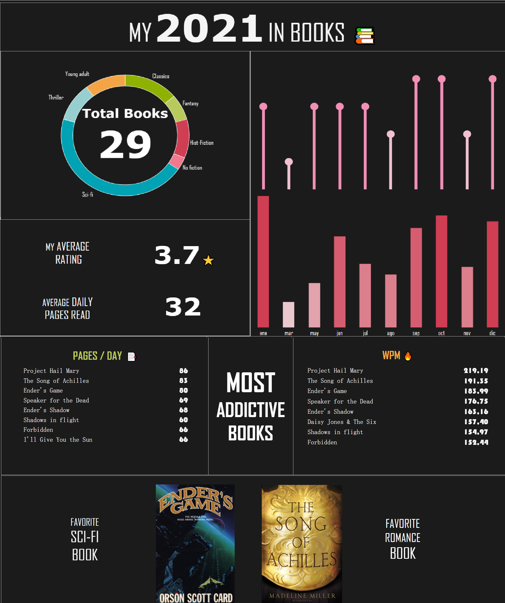

My year in books - 2021
===================

[**View dashboard online HERE**](https://public.tableau.com/app/profile/lucero.emperatriz.sovero/viz/Mybookshelf/DASH1)

Description
--------
This is a personal project that I do annually to track my readings.
The data used was extracted from [**my Goodreads**](https://www.goodreads.com/user/show/107295298-lucero) account with the exception of the number of words per book, which was compiled from  [**Word Counters**](https://wordcounters.com/) website.

Objective
--------

Visualization
--------
You can view the [**dashboard in Tableau HERE**](https://public.tableau.com/app/profile/lucero.emperatriz.sovero/viz/Mybookshelf/DASH1)
a[asd](https://public.tableau.com/app/profile/lucero.emperatriz.sovero/viz/Mybookshelf/DASH1&:showVizHome=no)

<iframe src="https://public.tableau.com/app/profile/lucero.emperatriz.sovero/viz/Mybookshelf/DASH1"></iframe>

This is an overview:

Contact
--------
Lucero Emperatriz Sovero [website](https://github.com/Lu-Emperatriz/LuPortfolio.github.io.git).

View more projects [HERE](https://github.com/Lu-Emperatriz?tab=repositories).  

